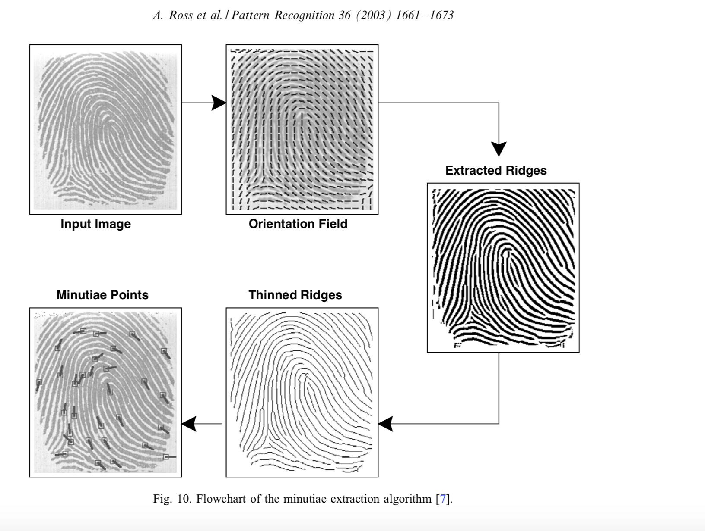

# Biometrics project description 

The goal is to develop a fingerprint recognition biometric system and carry out a thorough performance evaluation in verification mode on 3 (to be confirmed) different datasets.

Eventually and if proven robust enough, the system might be integrated as an alternative ticketing solution into the ROMA ATAC public transportation system.

## Feature extraction 

The underlying feature extraction technique used for our fingerprint recognition system will be based on minutiae extraction.

The minutiae extraction algorithm source code will mostly be implemented by engineering together some of the code available on the following [GitHub repository](https://github.com/rtshadow/biometrics).

## Matching algorithm 

We will implement ourselves the point matching algorithm using the minutiae features.

## Performance evaluation

We will assess the perfomance of our system in verification mode using the all-against-all strategy in both single and multi template settings

## Datasets

We will use 3 different datasets that can be found [here](http://www.advancedsourcecode.com/fingerprintdatabase.asp)

## Sources

The following [work](http://biometrics.cse.msu.edu/Publications/Fingerprint/RossJainReisman_HybridFpMatcher_PR03.pdf) will serve as a basis for the minutia extraction algorithm workflow.